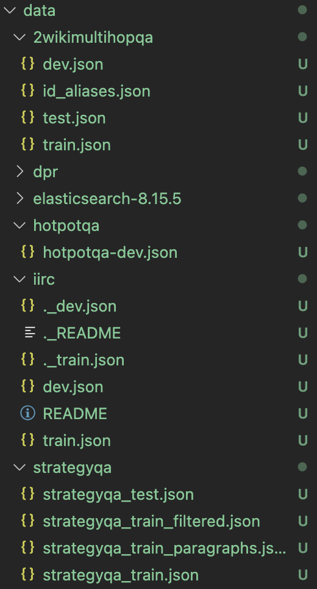

# Dynamic RAG Toolbox


Welcome to the official Dynamic RAG Toolbox, developed as part of our **SIGIR 2025 Tutorial: Dynamic and Parametric Retrieval-Augmented Generation**.


This repository provides a clean, modular, and easy-to-use codebase to **reproduce**, **compare**, and **extend** various Dynamic Retrieval-Augmented Generation (RAG) methods, including [DRAGIN (ACL 2024)](https://arxiv.org/abs/2406.06704), FLARE, and more.


## Table of Contents

- [Dynamic RAG Toolbox](#dynamic-rag-toolbox)
  - [Table of Contents](#table-of-contents)
  - [Overview](#overview)
  - [Supported Methods](#supported-methods)
  - [Very Quick Start](#very-quick-start)
  - [Code Structure](#code-structure)
  - [Customize and Extend](#customize-and-extend)
    - [Add a new "When to Retrieve" strategy](#add-a-new-when-to-retrieve-strategy)
    - [Replace the base LLM](#replace-the-base-llm)
    - [Add a new Dataset](#add-a-new-dataset)
    - [Add New Retrieval Strategy](#add-new-retrieval-strategy)
    - [Evaluate Your Method](#evaluate-your-method)
  - [Citation](#citation)
  - [Contributing](#contributing)


------

## Overview

This toolbox implements a range of **Dynamic RAG strategies**, focusing on:

- **When to retrieve** (e.g., token-level uncertainty, attention entropy)

- **What to retrieve** (e.g., based on hallucinated tokens or real words)

  

Originally developed for research, the codebase has been modularized and simplified to serve as an **educational toolkit** for the IR and NLP community.


## Supported Methods

| Method                          | Paper           | Description                                                  |
| ------------------------------- | --------------- | ------------------------------------------------------------ |
| **DRAGIN**                      | Su et al. ACL 2024        | Retrieval triggered by attention entropy + query formulation via self-attention |
| **FLARE-style**                 | Jiang et al. EMNLP 2023      | Triggered on low-confidence tokens using token log-probs     |
| **IC-RALM**              | Ram et al. TACL 2023        | Fixed-length chunk retrieval with iterative decoding         |
| **IR-CoT**            | Trivedi et al. ACL 2023 | Sentence-level iterations with retrieval each turn           |
| **Entity RAG**                  | Su et al. SIGIR-AP 2024   | Trigger retrieval when named entity hallucination is detected |
| **Single Retrieval (Baseline)** |                 | Static retrieve-then-generate pipeline                       |
| **No Retrieval (Ablation)**     |                 | Pure generation without retrieval                            |


## Very Quick Start

We recommend starting with a small open-source model like `TinyLlama/TinyLlama-1.1B-Chat` or `mistralai/Mistral-7B-Instruct-v0.2`.

```bash
# Step 1: Create environment
conda create -n dynamicrag python=3.9
conda activate dynamicrag
pip install -r requirements.txt
python -m spacy download en_core_web_sm

# Step 2: Download and index Wikipedia
# Expected output: '### Successfully built index "{index_name}" ###'
# Or you can use cmd line instructions 'curl -X GET "http://localhost:9200/_cat/indices?v"'
./scripts/setup_wikipedia_index.sh
```

- **NOTE**: Although we have tried our best to configure Elasticsearch so that you can start it easily, there may still exist some issues due to environment differences. Therefore, we strongly reccommend you to use LLMs(ChatGPT, Gemini, etc) to help you resolve errors if you encounter any. Besides, please read the comments in this bash script carefully because some parts are ONLY needed for first use and you should comment them afterwards.
- You can use cmd line instructions `curl -X GET "http://localhost:9200/_cat/indices?v"` to check whether you have successfully build wiki_index. Expected output is:
```bash
health status index uuid                   pri rep docs.count docs.deleted store.size pri.store.size dataset.size
yellow open   wiki  I9oMCchXQYqu64hT-fgxCA   1   1   21015324            0     11.2gb         11.2gb       11.2gb
```

```bash
# Step 3: Download Supported Datasets
./scripts/download_datasets.sh
```
The structure of your **data/** directory should be like:




```bash
# Step 4: Example - Run DRAGIN on 2WikiMultihopQA with TinyLlama/TinyLlama-1.1B-Chat-v1.0
# result files (config.json, output.txt) will be stored to directory 'result/tinyllama_1.1b_chat_2wikimultihopqa/0'
python src/main.py -c configs/TinyLlama-1.1B-Chat/2WikiMultihopQA/DRAGIN.json

# Step 5: Evaluate generated results
python src/evaluate.py --dir result/tinyllama_1.1b_chat_2wikimultihopqa/0
```

Expected results on several models and datasets:

| Model                     | Method | 2Wiki    | 2Wiki    | Hotpot    | Hotpot    | IIRC    | IIRC    | StrategyQA    | StrategyQA    |
| ------------------------- | ------ | -------- | -------- | --------- | --------- | ------- | ------- | ------------- | ------------- |
|                           |        |    EM    |   F1     |    EM     |     F1    |   EM    |   F1    |     EM        |        F1     |
| **qwen2.5-1.5b-instruct** | wo-rag | 0.18     | 0.2008   | 0.00      | 0.0390    | 0.06    | 0.1153  | 0.60          | 0.60          |
|                           | sr-rag | 0.24     | 0.2745   | 0.06      | 0.0894    | 0.06    | 0.1423  | 0.64          | 0.64          |
|                           | fl-rag | 0.18     | 0.2110   | 0.06      | 0.1490    | 0.06    | 0.1291  | 0.56          | 0.56          |
|                           | fs-rag | 0.20     | 0.2479   | 0.06      | 0.1512    | 0.04    | 0.0933  | 0.48          | 0.48          |
|                           | flare  | 0.16     | 0.2079   | 0.00      | 0.0292    | 0.04    | 0.0657  | 0.56          | 0.56          |
|                           | dragin | 0.32     | 0.3508   | 0.02      | 0.0801    | 0.14    | 0.1840  | 0.48          | 0.48          |
| **llama3.2-1b-instruct**  | wo-rag | 0.12     | 0.1697   | 0.04      | 0.0910    | 0.04    | 0.0570  | 0.58          | 0.58          |
|                           | sr-rag | 0.20     | 0.2402   | 0.12      | 0.1681    | 0.08    | 0.1206  | 0.62          | 0.62          |
|                           | fl-rag | 0.08     | 0.1198   | 0.12      | 0.2001    | 0.02    | 0.0513  | 0.52          | 0.52          |
|                           | fs-rag | 0.16     | 0.2359   | 0.18      | 0.2424    | 0.04    | 0.0580  | 0.54          | 0.54          |
|                           | flare  | 0.08     | 0.1641   | 0.04      | 0.1124    | 0.02    | 0.0369  | 0.52          | 0.52          |
|                           | dragin | 0.16     | 0.2296   | 0.06      | 0.1243    | 0.04    | 0.0720  | 0.56          | 0.56          |

- Note that these numbers are from the first 50 items of each dataset. Run `./scripts/run_all.sh` to start quickly.

## Code Structure

```
bash

DynamicRAG/
├── src/
│   ├── main.py            # Main entry point
│   ├── generate.py        # Core generation + retrieval strategies
│   ├── retrieve/          # BM25 / SGPT retriever definitions
│   ├── data.py            # Dataset definitions (2Wiki, HotpotQA, StrategyQA, etc.)
│   └── evaluate.py        # Evaluation script (EM/F1/etc.)
├── data/                  # Downloaded datasets & wiki corpus
|── configs/               # Example configuration files
├── result/                # Output and evaluation results
|── scripts/               # scripts for conducting preparations, such as downloading datasets and preparing corpus
└── README.md
```

------


## Customize and Extend

### Add a new "When to Retrieve" strategy

Go to `src/generate.py`, modify or subclass `BasicRAG` (e.g., `TokenRAG`, `EntityRAG`, `AttnWeightRAG`). Use model signals like:

- `transition_scores` (token logprobs)
- `attention weights`
- `entropy` or token surprise

### Replace the base LLM

In your config: replace it with your prefered LLM

```json
"model_name_or_path": "TinyLlama/TinyLlama-1.1B-Chat" 
```

Any **causal LLM** supported by HuggingFace (`AutoModelForCausalLM`) should work.

### Add a new Dataset

Create a new class in `src/data.py`, subclass `BaseDataset`, implement `__init__`, examplars, prompt_template, result_process_function (get_real_prediction, e.g) , etc.

Sample datasets already supported:

- 2WikiMultihopQA
- StrategyQA
- HotpotQA
- IIRC

### Add New Retrieval Strategy

We already support:

- `"retriever": "BM25"` (via Elasticsearch)
- `"retriever": "SGPT"` (semantic dense retrieval)

To add your own, implement a class in `src/retrieve/retriever.py` and integrate it in `BasicRAG.__init__`.

------


### Evaluate Your Method

After your implementation, you can evaluate your method by the following two steps:
```bash
# First, generating response with your own method and config.
python src/main.py -c configs/your_config_file

# Once generated, run:
python src/evaluate.py --dir result/your_output_dir
```

You will obtain:

- `result.tsv`: EM / F1 scores
- `details.txt`: prediction + post-processed answer
- `output.txt`: optional counters (tokens, generations, hallucinations, etc.)

------


## Citation

If you use this toolbox in your research or teaching, please cite:

```bibtex
@inproceedings{su2025dynamic,
  title={Dynamic and Parametric Retrieval-Augmented Generation},
  author={Su, Weihang and Ai, Qingyao and Zhan, Jingtao and Dong, Qian and Liu, Yiqun},
  booktitle={Proceedings of the 48th International ACM SIGIR Conference},
  year={2025}
}
```

------


## Contributing

Feel free to open issues or pull requests. If you are implementing a new strategy or fixing compatibility with a new model, we’d love to hear from you!
